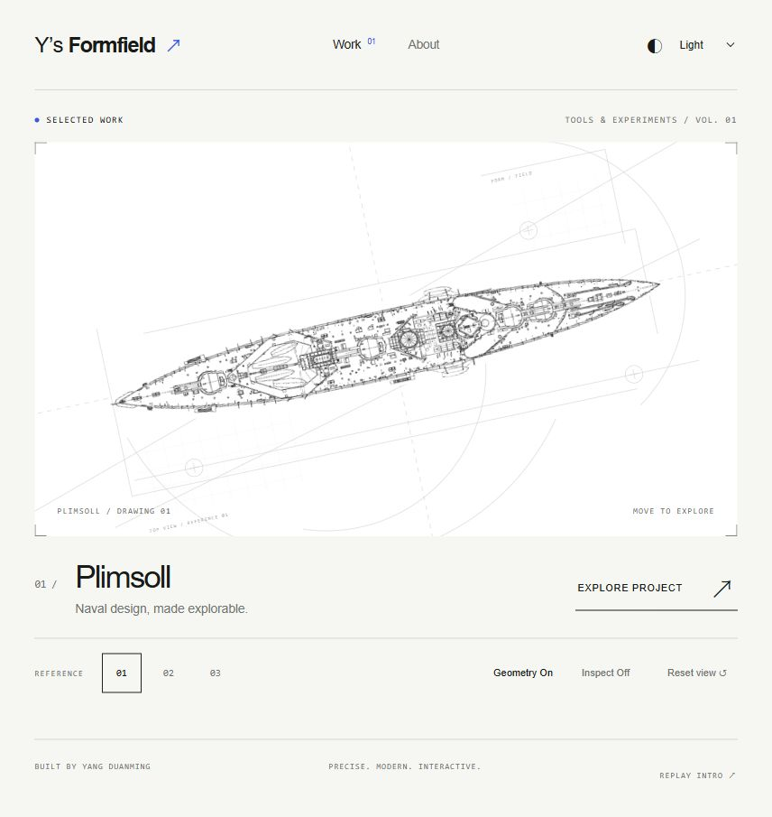
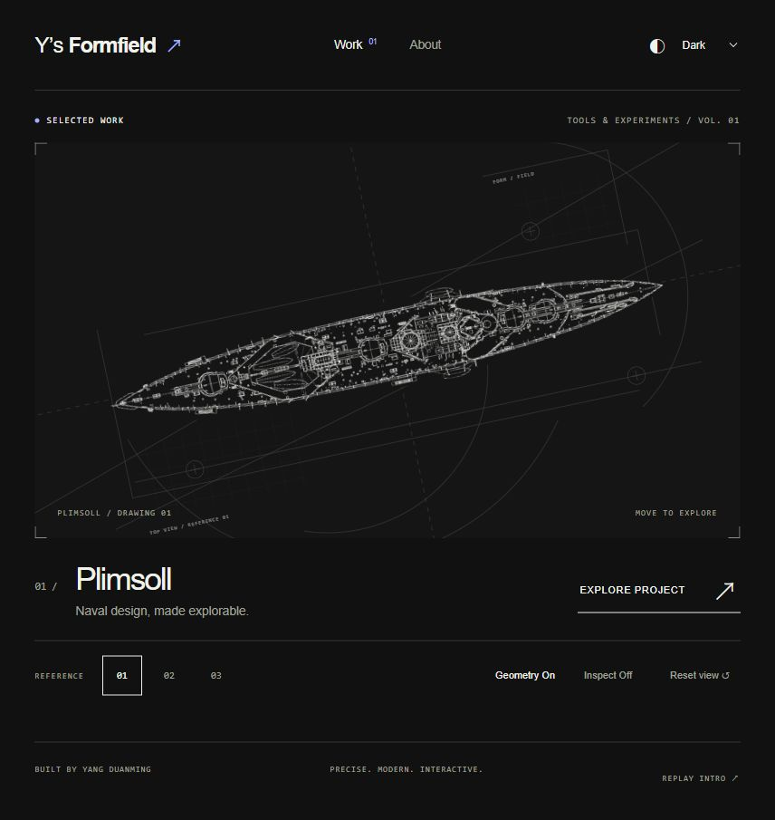

# 交接：Y’s Formfield 总站首页与线图资产

> 2026-10-05 补记：首页、原图、测试和本文已通过本地提交 `fc71434` 保存。下列“未提交”描述为 10 月 4 日历史快照，不代表当前 Git 状态。图片等待、逐帧渲染及滚动问题已修正；以[最新补充交接](review-hardening-2026-10-05.md)和 `git status` 为准。

更新时间：2026-10-04（北京时间）。本文件描述本地作品集首页的当前状态，不替代 Plimsoll 计算核心与生产运维交接。

## 1. 接手先读

用户已认可当前原图方案，并要求保存交接和资产地址。下一轮应在此基础上精校。

- 站名：**Y’s Formfield**；公共 UI 使用英文。
- 方向：精准、现代、高互动性；冷静公共框架＋大胆作品展示。中央固定大展台，内部探索。
- 主视觉：**用户提供的原始舰船俯视线图，保留复杂细节**。只做温和净底、墨线对比度与主题适配。
- 上一轮几何简化稿被用户明确否定，不要重新使用；不要把密集但有意义的设备、甲板纹理当噪点删除。
- 图像生成工具做过修复试样，但局部线条发生变化，已放弃；正式页面未引用该试样。
- 本轮仅完善首页，不改变 Plimsoll 计算功能、Unity、服务器或生产配置。

## 2. 位置与版本

| 项目 | 当前地址／状态 |
|---|---|
| **实际开发工作树** | `C:/Users/杨睿/Documents/Codex/2026-09-17/shi/work/plimsoll-1.0` |
| 前端根目录 | `C:/Users/杨睿/Documents/Codex/2026-09-17/shi/work/plimsoll-1.0/web/frontend` |
| 分支 | `feature/plimsoll-1.0` |
| 当前 HEAD | `90b201f` — `docs: normalize public launch evidence line endings` |
| 当前首页修改 | **未提交、未部署**；包含未跟踪的新组件、原图、测试和文档，接手时先看 `git status --short` |
| 本地预览 | `http://127.0.0.1:5173/`（本机 Vite 运行时可用） |
| 工具入口 | `http://127.0.0.1:5173/#/plimsoll` |
| 远端仓库 | `https://github.com/anon1919810/wi-naval-game`（私有） |
| 旧桌面主仓库 | `C:/Users/杨睿/Desktop/HMS_Queen_Mary_建模成果_2026-09-17`；不是本轮前端修改所在目录 |
| 既有生产站记录 | `https://119.91.211.156`；来源为既有生产交接，本轮未核验公网，也未把 Formfield 部署上去 |

本文件中的相对路径均相对于上述**实际开发工作树**。不要把 HEAD 当成首页已保存到 Git 的证据；新页面仍在工作区。

## 3. 正式资产清单

| 资产 | 仓库路径 | 说明 |
|---|---|---|
| 原图 01 | `web/frontend/public/portfolio/ship-plan-01.png` | 1000×451；俯视裁剪 x=0、y=290、w=1000、h=161 |
| 原图 02 | `web/frontend/public/portfolio/ship-plan-02.png` | 1018×451；俯视裁剪 x=0、y=290、w=1018、h=161；保留深色甲板 |
| 原图 03 | `web/frontend/public/portfolio/ship-plan-03.png` | 1063×542；俯视裁剪 x=0、y=360、w=1063、h=182；保留原灰度填充 |
| 原图来源和处理说明 | `web/frontend/public/portfolio/PROVENANCE.md` | 用户图片文件名映射、处理方法与用途边界 |
| 原图 SHA-256 清单 | `docs/formfield/assets/source-sha256.csv` | 本次交接时的文件校验值 |
| **当前浅色截图** | `docs/formfield/assets/accepted-home-light.jpg` | 实际本地页面截图，不是概念图 |
| **当前深色截图** | `docs/formfield/assets/accepted-home-dark.jpg` | 同上，第一幅线图 |

原 PNG 没有被离线重绘或覆盖。当前清晰化发生在浏览器 SVG 滤镜中，**没有另一个“高清清晰化 PNG”需要寻找**。迁移需连同组件代码和 `public/portfolio` 一起复制。

原始来稿对应文件名：

1. `1fd9fa6e3e59c33810b83d592c6f0445.png`
2. `fa34fa309156a46639b14f6711071f66.png`
3. `e0f79109169de78baa73c0505855ffc7.png`

旧截图位于 `C:/Users/杨睿/.codex/visualizations/2026/10/04/formfield/`。其中 `vector-*.jpg` 是**已否定的简化稿**，`homepage-*.jpg`、`reverse-scan.jpg` 是较早版本；请以本交接归档的 `accepted-home-*.jpg` 为准。

未采用的生成试样：`C:/Users/杨睿/.codex/generated_images/01a0ae33-8cf5-7353-b6f0-a34380de03bc/exec-8bec4181-1763-440d-9ed3-9b5553ca86cb.png`。仅供历史对照，不是正式资产。

## 4. 设计与交互约定

- 只显示俯视图，不显示侧视图。Reference 01/02/03 是同一 Plimsoll 作品的图稿切换，不是三个不同应用，也不是已考证为同一舰的三张工程图。
- 开场时舰船放大、斜向出画；最后收整为中央展台。几何辅助线置于底层，使用裁切、圆弧、轴线和局部网格营造蓝图构成感，不表达真实测量数值。
- 开场总时长 **2500 ms**：0–100 黑屏；100–900 左上向右下揭示白线；900–1100 停留；1100–1800 反向扫描；1800–2500 收整。角度 -28°→-12°，缩放 1.85→1。
- 浅色模式反向扫描后白底黑线；保存为深色时终态跟随深色主题。默认浅色，支持 Light/Dark/System，浏览器本地保存。
- 每次新文档进入首页／刷新播放。站内 Work/About、返回首页不重播；直接进入 About 或既有工具链接不播放首页开场。
- Replay Intro 重播；Escape／Skip Intro 跳过；系统 `prefers-reduced-motion` 下直接展示。
- 鼠标移动／方向键探索；Home／Reset view 复位；Geometry 开关辅助线。
- Inspect 当前仅显示焦点标记，**不是放大镜、部件拾取或舰船参数查询**。
- 公共首页不调用工作区认证 API。Explore Project 延迟加载原 Plimsoll 应用，保留 `#/projects/...`、`#/runs/...`、`#/reports/...`。

## 5. 代码地图与图像处理

所有下列组件位于 `web/frontend/src/portfolio/`：

| 文件 | 职责 |
|---|---|
| `Portfolio.tsx` | 公共首页、About、交互、主题选择、工具入口 |
| `VesselDrawing.tsx` | 原图显示、精准俯视裁剪、净底与着色；仅遮罩保留近似舰体路径 |
| `Artwork.tsx` | 舰船与几何辅助线构图，主视图及扫描共用 |
| `plans.ts` | 三张原图 URL、原始尺寸、裁剪坐标 |
| `Splash.tsx` | 开场动画生命周期、跳过及收整位置 |
| `motion.ts` | 2500 ms 时序、斜向扫描裁切、角度与缩放 |
| `portfolio.css` | 公共页面排版、断点、样式与动效 |
| `routes.ts` / `theme.ts` | 路由判别／本地主题 |

入口改动在 `web/frontend/src/main.tsx` 和 `web/frontend/index.html`。验收测试在 `web/frontend/src/__tests__/portfolio.test.tsx`。

处理链：原始灰度→反亮度作为 alpha→轻量线性调整（slope=1.08，intercept=-0.035）→与 SourceAlpha 相乘→按主题墨色着色。无边缘提取、卷积、膨胀、描摹或超分辨率。非常浅的杂点与淡线会一起减弱；不能自动区分黑色噪点与有效设备细节。

已修复的关键问题：

1. 反亮度把透明像素变成实黑，产生矩形黑边：用 SourceAlpha 限制结果。
2. 仅设置 viewBox／overflow 在比例留白处仍漏出侧视片段：用源坐标 clipPath 严格裁剪。

不要删除这两道边界处理。原稿仍约千像素宽，大幅放大有真实分辨率上限。

## 6. 运行、验证与现有证据

```powershell
Set-Location 'C:/Users/杨睿/Documents/Codex/2026-09-17/shi/work/plimsoll-1.0/web/frontend'
npm run dev -- --port 5173
```

若 5173 已有当前 Vite 进程，直接复用，不要重复启动或误结束其他项目进程。构建输出为 `web/frontend/dist/`，是可再生成的产物，源码与原图才是交接依据。

本轮最后代码验证（2026-10-04）：

- `npm test -- src/__tests__/portfolio.test.tsx --reporter=dot`：**19/19 通过**。
- `npm run build`：**TypeScript＋Vite 生产构建通过**。
- 浏览器：三幅原图、浅深主题、裁剪与黑边修复均已目视核对，结束时恢复用户深色偏好；未发现控制台错误。
- 早期首页曾通过原有 105 项前端测试；本轮没有重跑全量，也没有重跑计算核心。测试文件在修正 SVG 属性／选择器大小写后定向复跑通过。
- 390／320 手机宽度布局验收来自此前首页迭代；**恢复原图后未再次完整跑手机及实体触控验收**。触控逻辑已实现，但不应宣称实体设备已测。
- 本次交接仅写文档、归档截图和校验值，不重复运行计算或前端测试。

后端需另行运行，现有 Vite `/api` 代理指向 `127.0.0.1:8000`。本轮没启动后端，也没重新验收计算、保存或线上服务。

## 7. 下一步建议

1. 在当前细节密度上精校占幅、墨线强弱和辅助线权重；用户最新认可的是原稿方案。
2. 若需要大屏／高 DPI 进一步清晰，优先取得更高分辨率同源图，不用生成式重画冒充原图复原。
3. 发布前补做冷缓存开场、手机原图、实体触控与后端跳转验收。当前开场不等待图片加载；慢网下线稿可能晚于扫描出现，此场景尚未验收。
4. 完成下一轮视觉确认后再整理 Git 提交与生产发布；本次请求没有执行提交／部署。

继续阅读：[首页实现说明](../formfield-homepage.md) · [设计约定及后续纠正](../superpowers/specs/2026-10-04-formfield-design.md) · [初始实施计划](../superpowers/plans/2026-10-04-formfield-homepage.md) · [既有生产交接](../plimsoll-1.0/web-production-handoff-2026-10-04.md)。

## 当前认可效果




