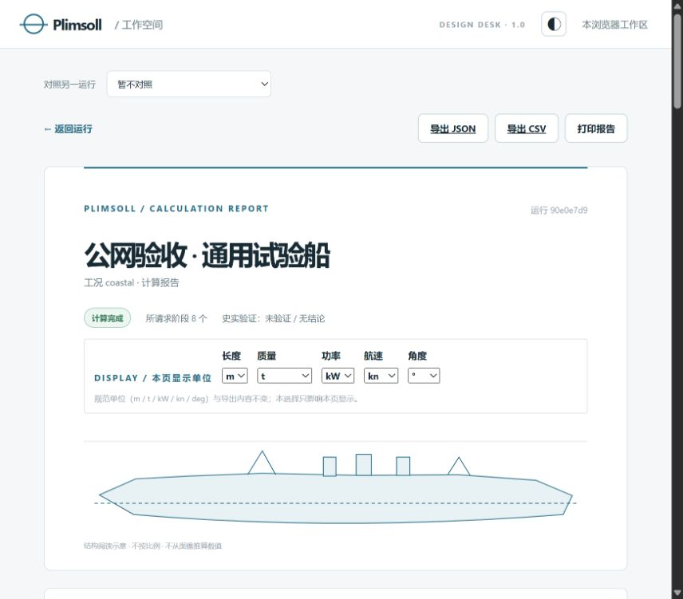

# 网站生产部署交接 · 2026-10-04

2026-10-04。仓库：`C:\Users\杨睿\Documents\Codex\2026-09-17\shi\work\plimsoll-1.0`；分支 `feature/plimsoll-1.0`；部署源码提交 `6dea93c`（`fix: allow memory for large ship reports`）。运行手册与逐条命令见[生产运维手册](web-production-operations.md)。运行时代码与发布归档自 `6dea93c` 起未变，字节数一致；此后只有文档提交，最新文档提交记录为 `9dac991`，再往后的提交以 `git log` 为准。

## 一句话状态

**公网上线验收已通过。** 站点地址 **[https://119.91.211.156](https://119.91.211.156)**（直接用 IP 访问，未绑定域名）。外部 HTTPS 健康检查与真实浏览器全流程都已走通，没有阻塞上线的遗留项。上线前 443 确实不通，成因是腾讯云安全组未放行；控制台放行后即解决，该段历史记录保留在文末。

## 已完成并实测

| 项目 | 事实 |
|---|---|
| 发布目录 | `/opt/plimsoll/releases/plimsoll-web-20261004T025804Z-6dea93c` |
| 当前链接 | `/opt/plimsoll/current` 已指向该发布目录 |
| 发布归档 | SHA-256 `35bbe801d93227d488b87edeacda2d056f2b282fcddf41d33121974edf341742`；112 个文件，4,661,093 字节为**解包后文件总字节数**，不是压缩包大小 |
| 容器 | `db` 运行中 384 MiB、`api` 运行中 512 MiB、`worker` 运行中 640 MiB（单实例）、`migrate` 256 MiB 已退出 0 |
| 数据库 | 迁移头 `6226f03d283f`；仅在 compose 网络内可达，不发布端口 |
| API 入口 | 只监听 `127.0.0.1:18000`，`/api/health` 返回 `status: ok` |
| 认证 | `PLIMSOLL_AUTH_MODE=anonymous`，本机请求中生效；无邮件、无 SMTP、无公开登录 |
| nginx | 已切换到 Plimsoll 站点；旧服务 `dsh.service` 已 `stop`、`disable` 并随后删除单元文件 |
| 公网 HTTP | 308 跳转到 `https://119.91.211.156`（计划中的公网地址） |
| 本机 TLS | 握手通过，Let's Encrypt IP 证书真实且证书链可信，有效期 10 月 4 日至 10 月 10 日 |
| 证书续期 | `certbot renew --dry-run` **通过**，见下文 |
| 备份 | 见下文「备份与恢复」 |
| 限流 | `plimsoll_general`（10r/s、burst 20）已在 API 段启用；`plimsoll_bootstrap` 仅定义未挂载 |
| 云安全组 | 腾讯云控制台已放行 TCP 443（来源 `0.0.0.0/0`），规则生效 |
| 公网 HTTPS | **通过**：Windows `curl https://119.91.211.156/api/health` 返回正常，无 `-k`、无证书告警 |
| 公网浏览器 | **通过**：真实浏览器（CUA）走通匿名工作区 → 建项 → 改名保存修订 → 刷新 → 运行 → 报告 → 下载 |

### 内存上限

Queen Mary 大型 CSV 导出曾在 API 256 MiB 上限下触发容器 OOM。修复方式**只是把部署侧内存上限调高**（API 512 MiB、worker 640 MiB），没有改动应用代码或计算核心。常驻上限合计 1536 MiB，迁移容器退出后不占预算。在当前 512 MiB 上限下跑完两轮 Queen Mary 大报告导出后，**API 容器重启次数为 0**。

### 针对性运行（服务器上执行）

| 场景 | 用时 | 阶段 | JSON 导出 | CSV 导出 |
|---|---|---|---|---|
| Queen Mary 正常载荷 | 16.53 s | 8 个默认阶段全部完成 | 3,623,399 字节 | 53,690,714 字节 |
| Queen Mary 满载 | 16.66 s | 8 个默认阶段全部完成 | 3,744,054 字节 | 54,509,546 字节 |

另外两个通用场景：`generic_steamer`（沿海）成功，3.94 s；方箱场景 2.67 s 为 `partial`，属预期 —— 该代理没有动力输入，不是缺陷。

### 匿名工作区隔离

服务器本机通过真实证书验证的 HTTPS 反向代理专项检查：SPA 与两个静态资源返回 200，资源带 immutable 缓存头；`/api/me` 无会话返回 401，匿名创建与私有项目列表返回 200，Cookie 含 Secure/HttpOnly；异源匿名创建返回 403，未知 API 路径返回 JSON 404。这些检查走 nginx 的 443 入口并在本机连接，不代表公网或浏览器验收。

用**各自独立 Cookie 的两个 HTTP 客户端**交叉访问同一批项目、运行与导出端点，非本浏览器的目标全部返回 404。这确认了匿名工作区按浏览器 Cookie 严格隔离。

该隔离结论来自 API 层 HTTP 请求；本轮已通过的真实浏览器（CUA）验收见下文「公网上线验收」。

### 备份与恢复

生产备份：`/opt/plimsoll/backups/plimsoll-db-20261004T030725Z.dump`，SHA-256 `4a2c89a60bb39ecd7606a58d031ba310d6254af5032fbe449e983820d3426727`。

恢复演练在**独立可丢弃数据库**上进行：项目 4、修订 8、运行 5，5 个运行的 `request_fingerprint` 与生产逐条一致，`alembic_version` 与生产一致。演练实例是与生产完全分离的一次性容器，使用独立的 `plimsoll_restore_check` 数据库，未挂专用命名卷。

每日自动备份已落地：`/usr/local/sbin/plimsoll-db-backup`（`root:root`、`700`）在容器内以 `sh -c` 展开 `POSTGRES_USER` / `POSTGRES_DB`、以 `</dev/null` 关闭标准输入，先写 `.tmp` 再原子 `rename`，随后计算 SHA-256；`umask 077`，备份目录 `root:root`、`700`。定时单元 `plimsoll-db-backup.service` / `.timer` 已 `enable --now` 且手工触发通过，`OnCalendar=*-*-* 03:00:00`、`RandomizedDelaySec=15min`、`Persistent=true`，核对时 `list-timers` 显示下次触发 **2026-10-05 03:10:56 CST**。

```bash
systemctl start plimsoll-db-backup.service
systemctl list-timers plimsoll-db-backup.timer
journalctl -u plimsoll-db-backup.service -n 50
```

**备份的真实边界：只有服务器本地副本。没有异地/离线备份，也没有自动保留或清理策略** —— 文件会一直累积，需要人工定期删除。

旧站点归档 `/opt/plimsoll/backups/legacy-dsh-20261004.tar.gz`（约 220 MB）：归档可完整列出，已核对覆盖预期目录（顶层含 `root/the-basement-of-anon` 与 `var/www/dsh`）。这里记录的是 `tar` 列表层面的核对，不是逐文件内容比对。核对与字面真实路径检查完成后，经用户授权，旧资产**已删除**：旧根仓库 `/root/the-basement-of-anon`、静态站点 `/var/www/dsh`、旧 systemd 单元与 `sites-available` 中的 `dsh`。归档本身保留，恢复仍需从该归档进行。

### 证书续期（已完成）

IP 证书只有 6 天有效期（10 月 4 日至 10 月 10 日），因此先验证续期链路。把 webroot 迁到 `/var/www/acme`（与 nginx 的 ACME `location` 根一致）之后：

```bash
sudo /opt/plimsoll/certbot/bin/certbot renew \
  --dry-run --non-interactive --no-random-sleep-on-renew
```

**结果：通过，全部模拟续期成功。** 续期链路的唯一未完成验收项已闭环。定时器仍在位：`OnBootSec=15min`、`OnCalendar=*-*-* 00,12:00:00`、`RandomizedDelaySec=30min`、`Persistent=true`。

### 一次性验证资源已清理

可丢弃的 `plimsoll-testdb` 容器与 `plimsoll-acceptance` Docker 网络在验证完成后已删除。生产容器与生产数据卷未受影响。

## 独立验收

| 验证 | 结果 |
|---|---|
| 后端独立全套 | 50 项通过、2 项跳过 |
| 前端独立全套 | 105 项通过；生产构建通过 |
| 部署文件测试（Windows） | 17 项通过、1 项跳过（无符号链接权限） |
| 部署文件测试（Linux） | 18 项全部通过 |
| PostgreSQL 独立实例专项 | 2 项**实际执行并通过**（非跳过） |

PostgreSQL 专项的实际执行环境：独立 Docker 网络 `plimsoll-acceptance`，测试库角色 `plimsoll_test`，**不映射宿主机端口、不挂宿主机卷**。手册里带 `-p 127.0.0.1:55432:5432` 的写法只是宿主机上可直接运行的示例，不是本轮的实际执行方式。

计算核心的 746 项是更早一次全量回归的**历史**数字；本轮只做部署，没有新增核心测试，也不代表核心重跑过。

## 公网上线验收（2026-10-04 通过）

入口放行：用户提供了腾讯云控制台截图，TCP 443 规则来源 `0.0.0.0/0`，规则已生效。这是此前 443 不通的直接原因。

### 独立命令行复测

在 Windows 上用 `curl` 直连公网地址请求健康检查，**不带 `-k`、无证书告警**，返回正常。这同时验证了证书链在公网侧可信。

### 真实浏览器验收（CUA）

浏览器打开 **[https://119.91.211.156](https://119.91.211.156)**：

| 步骤 | 结果 |
|---|---|
| 打开站点 | 自动获得匿名工作区，**没有邮箱、没有登录步骤** |
| 建项 | `generic_steamer`（沿海） |
| 改名 | 船名改为「公网验收 · 通用试验船」，保存修订 2 |
| 刷新 | 同一浏览器仍保留已保存的船名与修订 |
| 运行 | `coastal` 工况，8 个请求的默认阶段**全部完成并保存**，完整报告可见 |
| 报告页 | 输入未知项与「史实未认证」标注均保留 |



- 项目 `a00cfe7a-81ac-448c-9261-2f585f6ac930`
- 运行 `90e0e7d9-142e-4a30-a024-67c17468e0fa`
- 请求指纹 `f8d6d194f1a923583ffac3d0cd13a572b3566eb79750523c70226c68c34ff1c0`

### 导出下载

浏览器下载 JSON **708,739 字节**、CSV **11,069,804 字节**。JSON 与 CSV 首条数据记录的状态均为 `completed`，请求指纹与运行页一致。所请求的 8 个阶段全部完成，其余 7 个阶段保持 `not_requested`。下载文件 SHA-256、阶段状态和验收项保存在[机器可读上线证据](evidence/public-launch-2026-10-04.json)。

CSV 曾触发工具侧 15 秒等待超时，原因是约 11 MB 在约 4 Mbps 链路上传输本身就需要更长时间；随后浏览器下载在 **23.3 秒**完成，文件校验有效。**这是下载耗时超过工具等待阈值，不是服务端缺陷，没有为此改动任何代码。** 全程 API 容器重启次数为 0。

浅色 / 深色切换两个方向都验证过，并已切回浅色。报告页在浏览器中保持可见。

## 保留的已知限制

这些不是上线阻塞项，但用户需要知道：

- 匿名模式的 Cookie 归属浏览器，有效期 365 天。清除 Cookie、换浏览器或换设备都会得到新的工作区，旧工作区无法找回。
- 保留输入靠**下载完整项目 JSON**。手工恢复时先创建新项目，把备份 JSON 顶层 `id` 改成新项目的 `id`，在「完整项目数据」中应用并**保存**。报告的 JSON/CSV 是计算输出，不是项目备份。**没有一键导入功能，也没有跨设备账号恢复。**
- **备份只有服务器本地副本**：没有异地/离线备份，也没有自动保留或清理策略。
- 应用层匿名建工作区限额是 30 次/小时，按来源 IP 计数，且是**进程内**的有界节流 —— API 重启即清零。Nginx 限流是补充，不能被它替代。
- Nginx 限流区靠 `/etc/nginx/conf.d/*.conf` 在 `http` 上下文自动 include 生效；**不要再取消 `plimsoll.conf` 里那行 include 的注释**，重复定义同名 zone 会让 `nginx -t` 失败。
- 站点直接用 IP 访问，**未绑定域名**。IP 入口本身工作正常。
- 发布的是现有计算能力，**不是完整 SPS 复刻**。

## 历史记录：上线前的 443 不通（已解决）

保留这段是因为它真实发生过，也说明本机检查的局限。当时外部发起的 443 请求在服务器上 `tcpdump` 抓到 **0 个包**，HTTPS 与浏览器访问均失败；而本机 nginx 监听、TLS 握手与证书链都已通过。本机通过并不能证明链路上没有中间设备 —— 最终是腾讯云控制台放行 TCP 443 后复测通过，证实成因在云侧规则而非站点配置。

## 使用边界

匿名会话归属、JSON 备份与手工恢复、限额与限流、SPS 范围边界等使用限制见上文[保留的已知限制](#保留的已知限制)。要点重申：Cookie 归属单浏览器 365 天，无跨设备账号恢复；项目输入只能靠完整项目 JSON 留存，报告导出不是备份；站点未绑定域名，直接用 IP 访问。

## 复现命令

```powershell
# 发布包（干净工作区）
git status --porcelain
& web/backend/.venv/Scripts/python.exe web/deploy/build_release.py --output .superpowers/releases --confirm-source-frozen
& web/backend/.venv/Scripts/python.exe -m unittest discover -s web/deploy/tests -v
git diff --check
```

服务器上的部署、备份、恢复、限流与证书命令全部列在[生产运维手册](web-production-operations.md)中，均为可直接执行的完整示例。
